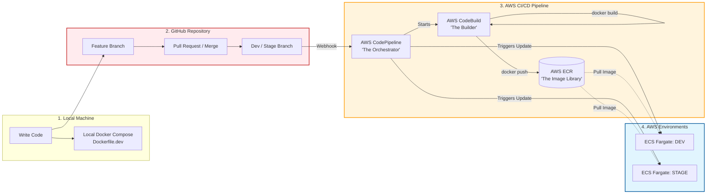

### Docker compose for local development
```bash
docker-compose -f docker-compose.yml up
```
Or just `docker-compoose up` since docker-compose.yml is the default file.


### Docker for server type environment
This compiles assets, doesn't have on-the-fly recompile, class reloading, etc

Building example which will put this image into the local docker registry

```bash
docker build -f Dockerfile.server -t ucnrs-rams:latest .
```

### Test the image once compiled locally.

```bash
docker run -p 3000:3000 --env-file .env.server ucnrs-rams:latest
```

note1: We may (or may not) change how environment variables are used.
The "rails way" for more modern versions is to use the master key
and unlock the environment credentials file for the current environment and then use
those credentials from the credentials store rather than passing in many environment
variables that are used directly in code.

note2: I wasn't sure if SMTP email server was needed either in the container or outside (or an
AWS email service). It sounds like there is currently a SendGrid account that allows RAMS to
send emails in production. It's possible we could send from that for other environments also. (?)


### build for Different Architecture (e.g., Intel or ARM64 for AWS Graviton)

(if you need to do that, for example a mac is arm and a AWS server may be Linux amd64)
```bash
# values could be linux/arm64 or linux/amd64 for example or separate by commas for multiple
docker buildx build --platform linux/amd64,linux/amd64 -f Dockerfile.server -t ucnrs-rams:latest .
```


### Github actions example (not tested or running, but interesting)

- There is a file `.github/workflows/development-deploy.yml` that claims to be able to deploy
  based on github actions.
- This is not tested yet, but may be an option for auto-deploying a development branch
  when changes happen to preview on some other server (alternative to codebuild in AWS)

### Deploy to AWS -- note, not tested and perhaps not how we'd want to do it, but an example

If following Brian's example we'd have new development code trigger AWS Codebuild
and then push to Elastic Container Registry (ECR) and then ECS Fargate.

```bash
# Build
docker build -f Dockerfile.server -t ucnrs-rams:v1.0.0 .

# Push to ECR
docker tag ucnrs-rams:v1.0.0 ACCOUNT.dkr.ecr.REGION.amazonaws.com/ucnrs-rams:v1.0.0
docker push ACCOUNT.dkr.ecr.REGION.amazonaws.com/ucnrs-rams:v1.0.0

# Or use the helper script
./scripts/docker-deploy.sh deploy-ecr v1.0.0 us-west-2 ACCOUNT_ID
```

## About difference in environment

### Dependencies & Environments
- **Local development**: Installs ALL gems and packages including dev/test
  ```ruby
  bundle install
  yarn install --check-files
  ```
  - Includes full build-essential
  - Chromium and chromium-driver for testing
  - All development libraries
  - Assets compiled on-demand by Rails
  - Single worker (or workers commented out)
  - Long worker timeout (3600s) for debugging
  - Development environment defaults
  - Runs as root user
  - Larger image size to include all dependencies and tools for development
  - Mounts codebase from local drive for live reloading
  - Database loaded up alongside with docker compose
  - Logs to log/ directory


- **Server**: Excludes development and test dependencies
  ```ruby
  bundle config set --local without 'development test'
  bundle install --jobs 4 --retry 3
  yarn install --production --frozen-lockfile --non-interactive
  ```
  - Builder stage: Full build tools for compilation
  - Runtime stage: Only minimal runtime libraries
  - No testing frameworks or browsers
  - Assets precompiled during Docker build
  ```bash
  RAILS_ENV=production SECRET_KEY_BASE=placeholder bundle exec rails assets:precompile
  ```
  - Multiple workers (default 2, configurable via WEB_CONCURRENCY)
  - Worker clustering with preload_app!
  - Optimized for production traffic
  - Shorter timeouts (30s)
  - Better logging for container environments
  - Creates and uses non-root 'rails' user
  - Restricts file permissions
  - Follows security best practices
  - Smaller image without build tools and dev/test and cache and temp files
  - Volume with what's needed to run the app and expects external server or RDS, perhaps external SMTP (TBD)
  - May want to look into JSON formatted logs or pushing them to observability layer such as OpenSearch (TBD)

### Resources & Files
- Dockerfile.server -- used for compiling/running docker in a server-way (shared dev preview, staging)
- config/puma.production.rb -- uses production-like settings for puma (w/o code reloading etc, multiple workers)
- but isn't automatically used just because a rails "production" environment is used
  
## Performance Tuning

### Puma Workers and Threads

- **Workers**: Set `WEB_CONCURRENCY` to match your container's CPU cores
  - 1 vCPU → 1 worker
  - 2 vCPU → 2 workers
  - 4 vCPU → 3-4 workers

- **Threads**: Set `RAILS_MAX_THREADS` based on your I/O workload
  - I/O heavy (many database queries): 5-10 threads
  - CPU heavy: 2-5 threads

### Database Connection Pool

Match `RAILS_MAX_THREADS` in your database.yml or set via environment:

```yaml
production:
  pool: <%= ENV.fetch("RAILS_MAX_THREADS") { 5 } %>
```

### Memory Considerations

- Baseline: ~150-200MB per Puma worker
- Add: ~10-20MB per thread
- Example: 2 workers × 5 threads ≈ 500-600MB minimum
- Recommend: 1-2GB memory allocation

## Monitoring and Logging

### Health Check Endpoint

The Dockerfile includes a health check on `/up` endpoint. Ensure this route exists in your Rails app:

```ruby
# config/routes.rb
get "up" => "rails/health#show", as: :rails_health_check
```

### Application Logs

Logs are written to STDOUT and can be accessed via:

```bash
# ECS/Fargate
aws logs tail /ecs/ucnrs-rams --follow

# Kubernetes
kubectl logs -f deployment/ucnrs-rams

# Docker
docker logs -f container_id
```

Brian's example of how they do things for dev/stg:

